# P5 Evaluación Momento 1

---

## 1. Título

Implementación de WordPress CMS con Docker, MySQL, phpMyAdmin, red personalizada y volúmenes

---

## 2. Tiempo de duración

40 minutos

---

## 3. Fundamentos

Docker es una herramienta que permite ejecutar aplicaciones dentro de contenedores. En esta evaluación se utilizó Docker para levantar un sitio WordPress sin instalar WordPress, MySQL o phpMyAdmin directamente en el sistema operativo. Esto ayuda bastante porque cada servicio queda separado, ordenado y se puede eliminar o volver a crear sin dañar el equipo principal.

Un contenedor se puede entender como un espacio independiente donde se ejecuta una aplicación. En este caso se trabajó con tres contenedores. El primero fue MySQL, que se encargó de guardar la base de datos del sitio. El segundo fue phpMyAdmin, que permitió revisar y administrar la base de datos desde el navegador. El tercero fue WordPress, que funcionó como el sitio web principal.

También se creó una red personalizada llamada `red_wordpress`. Esta red permitió que los contenedores se comuniquen entre ellos usando sus nombres. Por ejemplo, WordPress pudo conectarse con MySQL usando el nombre del contenedor `mysql_db` y el puerto interno `3306`. De la misma forma, phpMyAdmin también se conectó a MySQL por medio de la misma red. Esto fue importante porque no hizo falta exponer MySQL hacia afuera, ya que solo WordPress y phpMyAdmin necesitaban comunicarse con él.

Además, se usaron volúmenes para guardar la información. El volumen de MySQL permitió conservar los datos de la base de datos, mientras que el volumen de WordPress guardó los archivos del sitio. Esto es útil porque, aunque un contenedor se detenga o se elimine, los datos pueden mantenerse si el volumen sigue existiendo.

En esta evaluación se trabajó únicamente con comandos de Docker, sin usar Docker Compose. Esto permitió comprender mejor cada paso: crear la red, crear los volúmenes, ejecutar los contenedores, configurar variables de entorno, revisar los puertos y comprobar que el sitio WordPress funcionara correctamente desde el navegador.

---

## 4. Conocimientos previos

- Uso básico de terminal.
- Comandos básicos de Docker.
- Concepto de contenedor.
- Concepto básico de red.
- Conocimiento básico sobre bases de datos.
- Uso de navegador web.

---

## 5. Objetivos a alcanzar

- Crear una red personalizada en Docker.
- Crear un volumen para WordPress.
- Crear un volumen para MySQL.
- Crear un contenedor para MySQL.
- Crear un contenedor para phpMyAdmin.
- Crear un contenedor para WordPress.
- Comprobar que los contenedores se comuniquen por medio de la red Docker.
- Verificar el funcionamiento de WordPress desde el navegador.
- Verificar la base de datos de WordPress desde phpMyAdmin.
- Realizar la evaluación únicamente con comandos Docker, sin usar Docker Compose.

---

## 6. Equipo necesario

- Computador con Linux.
- Docker instalado y funcionando.
- Terminal.
- Navegador web.
- Conexión a internet para descargar las imágenes de Docker.

---

## 7. Material de apoyo

- Documentación oficial de Docker.
- Imagen oficial de WordPress en Docker Hub.
- Imagen oficial de MySQL en Docker Hub.
- Imagen oficial de phpMyAdmin en Docker Hub.
- Documentación de phpMyAdmin.
- Guía de la asignatura.

---

## 8. Procedimiento

---

### Paso 1 — Verificar Docker

Primero se revisó que Docker estuviera funcionando correctamente. Para esto se ejecutó el comando `docker ps`. Como no existían contenedores activos al inicio, la tabla apareció vacía.

Comando utilizado:

    docker ps

  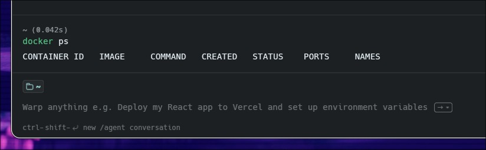
   
  <em>Figura 1. Verificación inicial de Docker sin contenedores activos.</em>

---

### Paso 2 — Crear la red personalizada

Se creó una red personalizada llamada `red_wordpress`. Esta red permitió conectar los contenedores de MySQL, phpMyAdmin y WordPress para que puedan comunicarse entre sí.

Comando utilizado:

    docker network create red_wordpress

Luego se verificó la red creada con:

    docker network ls

  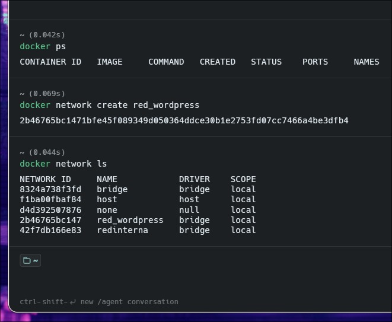
   
  <em>Figura 2. Creación y verificación de la red personalizada red_wordpress.</em>

---

### Paso 3 — Crear los volúmenes

Se crearon dos volúmenes. El primero fue para guardar los archivos de WordPress y el segundo para guardar los datos de MySQL.

Comandos utilizados:

    docker volume create volumen_wordpress

    docker volume create volumen_mysql

Después se verificaron con el comando:

    docker volume ls

  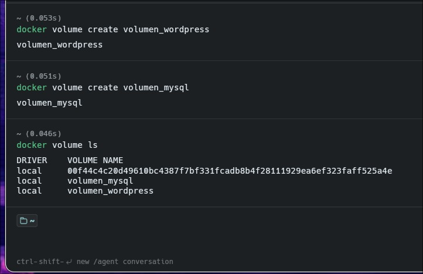
   
  <em>Figura 3. Creación de los volúmenes volumen_wordpress y volumen_mysql.</em>

---

### Paso 4 — Crear el contenedor de MySQL

Se creó el contenedor de MySQL con el nombre `mysql_db`. También se configuró la base de datos, el usuario, la contraseña y el volumen donde se guardarán los datos.

Comando utilizado:

    docker run -d --name mysql_db --network red_wordpress -e MYSQL_ROOT_PASSWORD=root123 -e MYSQL_DATABASE=wordpress_db -e MYSQL_USER=wordpress_user -e MYSQL_PASSWORD=wordpress_pass -v volumen_mysql:/var/lib/mysql mysql:8.0

Luego se verificó que el contenedor estuviera activo:

    docker ps

  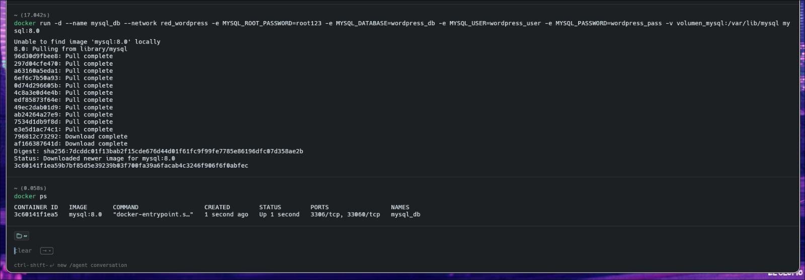
   
  <em>Figura 4. Creación del contenedor MySQL con la imagen mysql:8.0.</em>

---

### Paso 5 — Crear el contenedor de phpMyAdmin

Se creó el contenedor de phpMyAdmin para administrar la base de datos desde el navegador. Este contenedor se conectó a la misma red `red_wordpress` y se configuró para conectarse al contenedor `mysql_db`.

Comando utilizado:

    docker run -d --name phpmyadmin --network red_wordpress -e PMA_HOST=mysql_db -e PMA_PORT=3306 -p 8081:80 phpmyadmin/phpmyadmin

Después se revisó que phpMyAdmin estuviera activo:

    docker ps

  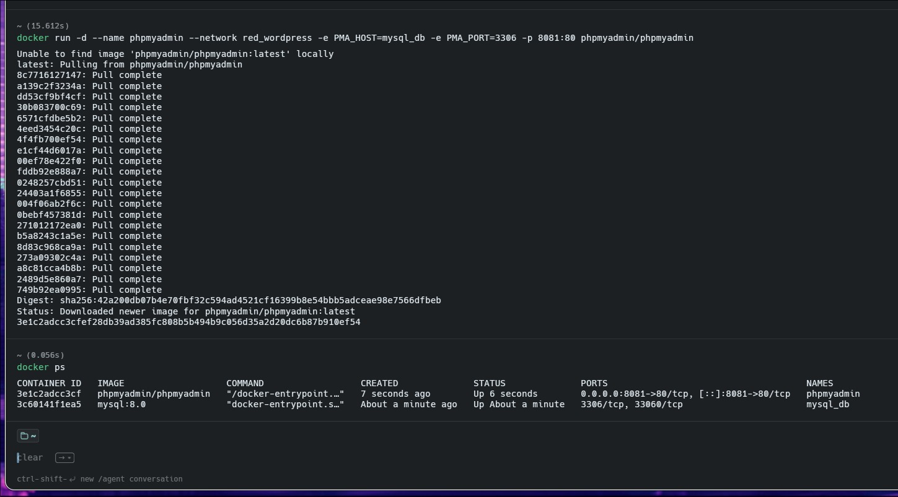
   
  <em>Figura 5. Creación del contenedor phpMyAdmin conectado a MySQL.</em>

---

### Paso 6 — Crear el contenedor de WordPress

Se creó el contenedor de WordPress con el nombre `wordpress_cms`. También se configuró la conexión hacia MySQL usando el nombre del contenedor `mysql_db` y la base de datos `wordpress_db`.

Comando utilizado:

    docker run -d --name wordpress_cms --network red_wordpress -e WORDPRESS_DB_HOST=mysql_db:3306 -e WORDPRESS_DB_NAME=wordpress_db -e WORDPRESS_DB_USER=wordpress_user -e WORDPRESS_DB_PASSWORD=wordpress_pass -v volumen_wordpress:/var/www/html -p 8080:80 wordpress:latest

Luego se verificó que los tres contenedores estuvieran corriendo:

    docker ps

  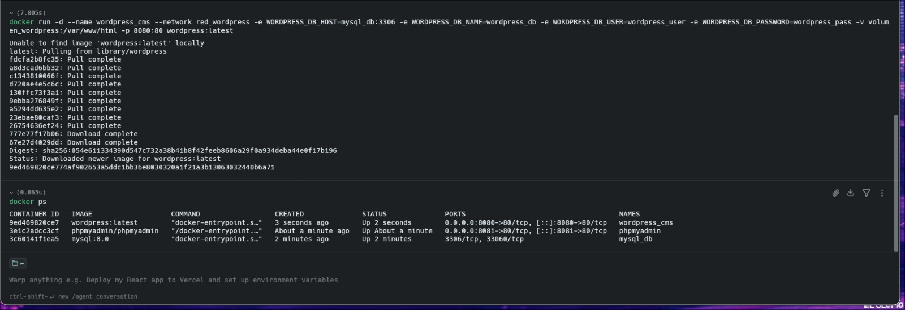
   
  <em>Figura 6. Verificación de los tres contenedores activos: MySQL, phpMyAdmin y WordPress.</em>

---

### Paso 7 — Ingresar a WordPress desde el navegador

Se ingresó a WordPress desde el navegador usando el puerto `8080`.

Dirección utilizada:

    http://localhost:8080

Al ingresar, apareció la pantalla de selección de idioma de WordPress.

  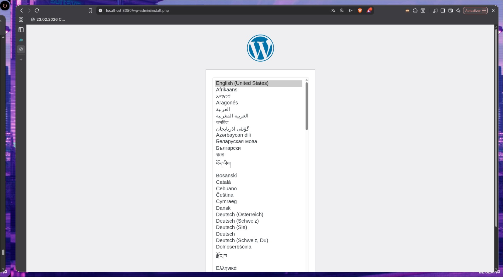
   
  <em>Figura 7. Pantalla inicial de instalación de WordPress.</em>

---

### Paso 8 — Completar la instalación de WordPress

Después de seleccionar el idioma, WordPress mostró el formulario de instalación. En esta parte se ingresó el título del sitio, el nombre de usuario, la contraseña y el correo electrónico.

  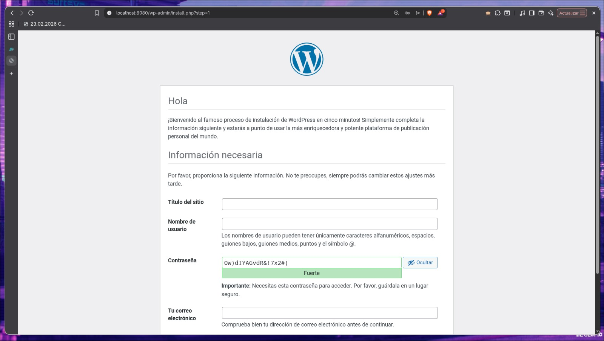
   
  <em>Figura 8. Formulario de instalación de WordPress.</em>

---

### Paso 9 — Verificar WordPress instalado

Una vez terminada la instalación, se ingresó al panel principal de WordPress. Esto comprobó que el contenedor de WordPress funcionaba correctamente y que logró conectarse con la base de datos MySQL.

  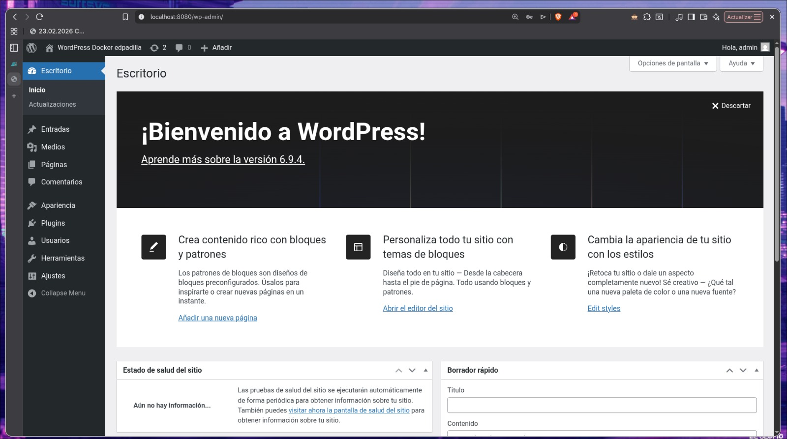
   
  <em>Figura 9. Panel principal de WordPress funcionando correctamente.</em>

---

### Paso 10 — Ingresar a phpMyAdmin

Se ingresó a phpMyAdmin desde el navegador usando el puerto `8081`.

Dirección utilizada:

    http://localhost:8081

Dentro de phpMyAdmin se revisó la base de datos `wordpress_db`, donde ya aparecían las tablas creadas por WordPress.

  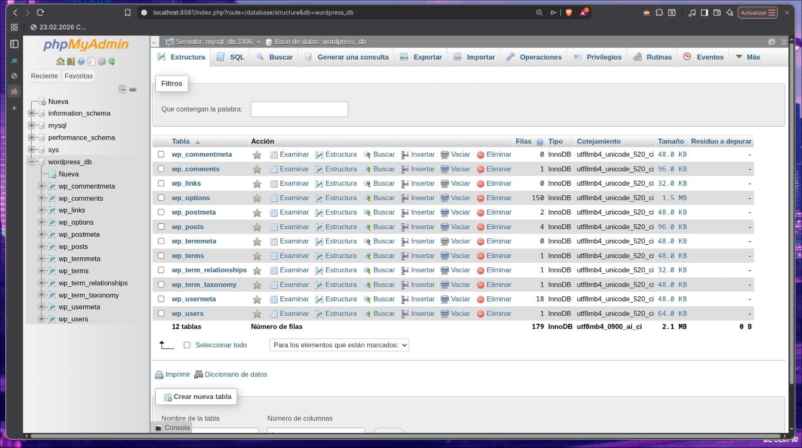
   
  <em>Figura 10. Base de datos wordpress_db visualizada desde phpMyAdmin.</em>

---

### Paso 11 — Inspeccionar la red Docker

Se inspeccionó la red `red_wordpress` para comprobar que los tres contenedores estaban conectados a la misma red.

Comando utilizado:

    docker network inspect red_wordpress

En la salida del comando se pudo observar que estaban conectados los contenedores `mysql_db`, `phpmyadmin` y `wordpress_cms`.

  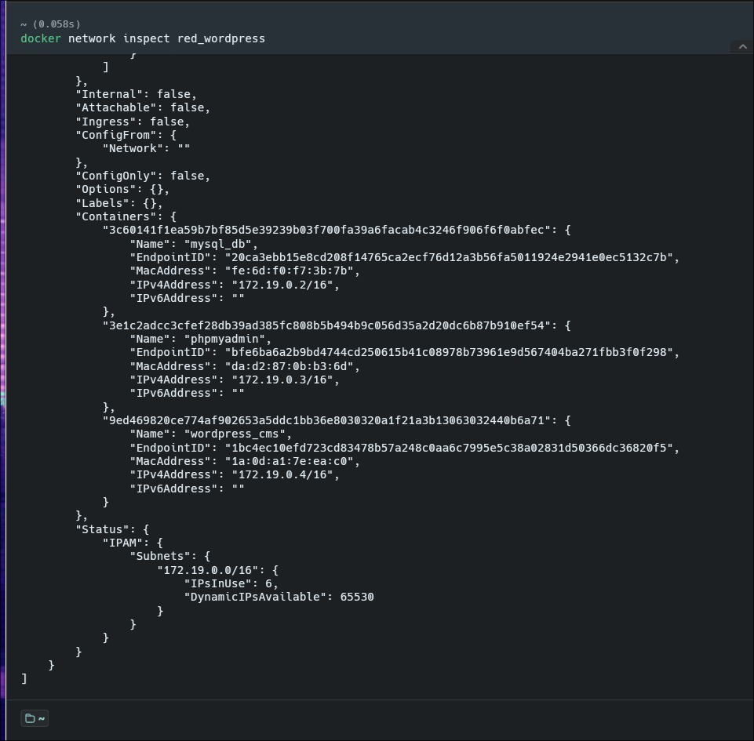
   
  <em>Figura 11. Inspección de la red red_wordpress mostrando los contenedores conectados.</em>

---

### Paso 12 — Inspeccionar los volúmenes

Se inspeccionaron los volúmenes creados para comprobar que Docker los reconocía correctamente.

Comandos utilizados:

    docker volume inspect volumen_mysql

    docker volume inspect volumen_wordpress

  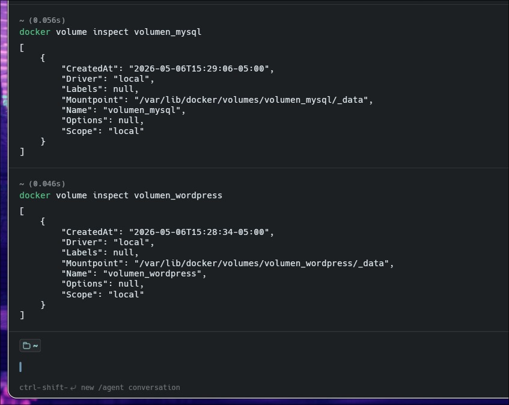
   
  <em>Figura 12. Inspección de los volúmenes volumen_mysql y volumen_wordpress.</em>

---

## 9. Diagrama de contenedores y puertos utilizados

El siguiente diagrama muestra cómo quedaron organizados los contenedores dentro del servidor. WordPress se abre desde el puerto `8080`, phpMyAdmin desde el puerto `8081` y MySQL usa el puerto interno `3306`. MySQL no tiene puerto externo porque solo lo usan WordPress y phpMyAdmin dentro de la red Docker.

  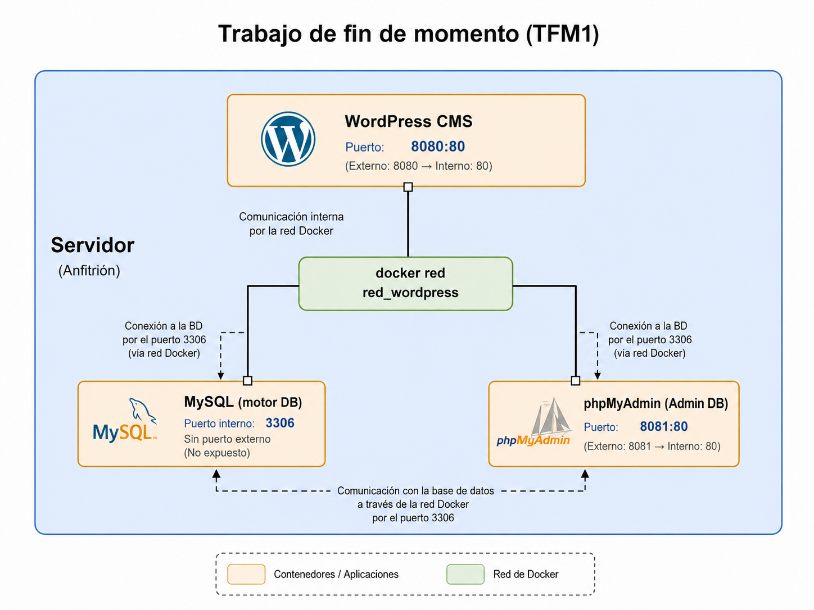
   
  <em>Figura 13. Diagrama de contenedores, red Docker y puertos utilizados.</em>

---

## 10. Tabla de contenedores y puertos

| Servicio | Contenedor | Imagen | Puerto externo | Puerto interno | Función |
|---|---|---|---|---|---|
| WordPress | wordpress_cms | wordpress:latest | 8080 | 80 | Sitio web CMS |
| MySQL | mysql_db | mysql:8.0 | No expuesto | 3306 | Base de datos |
| phpMyAdmin | phpmyadmin | phpmyadmin/phpmyadmin | 8081 | 80 | Administración de MySQL |

---

## 11. Resultados esperados

Se logró levantar correctamente un sitio WordPress usando únicamente comandos de Docker. También se creó una red personalizada llamada `red_wordpress`, la cual permitió la comunicación entre WordPress, MySQL y phpMyAdmin.

El contenedor de MySQL funcionó como base de datos del sitio. El contenedor de WordPress se conectó correctamente a MySQL y permitió completar la instalación desde el navegador. Además, phpMyAdmin permitió revisar la base de datos `wordpress_db`, donde se observaron las tablas creadas automáticamente por WordPress.

También se verificó que los volúmenes `volumen_mysql` y `volumen_wordpress` fueron creados correctamente. Estos volúmenes permiten conservar la información del sitio y de la base de datos.

Finalmente, se comprobó que no fue necesario usar Docker Compose, ya que todos los pasos se realizaron manualmente con comandos Docker.

---

## 12. Conclusión

En esta evaluación aprendí a crear un entorno completo para WordPress usando Docker. Primero creé una red para que los contenedores puedan comunicarse entre ellos. Luego creé los volúmenes para guardar los datos de WordPress y MySQL. Después levanté los contenedores de MySQL, phpMyAdmin y WordPress.

Lo más importante fue entender que los contenedores no trabajan separados si necesitan comunicarse. Por eso todos fueron conectados a la red `red_wordpress`. También comprendí mejor el uso de los puertos. WordPress se abrió desde `localhost:8080`, phpMyAdmin desde `localhost:8081` y MySQL usó el puerto interno `3306`, sin exponerlo hacia afuera.

Esta evaluación me ayudó a entender cómo se puede levantar un sitio web con base de datos de forma ordenada y sin instalar todo directamente en la computadora.

---

## 13. Bibliografía

- IBM. (2024). *¿Qué es Docker?* Recuperado de https://www.ibm.com/es-es/think/topics/docker

- Red Hat. (2026). *Docker: qué es, cómo funciona y sus ventajas*. Recuperado de https://www.redhat.com/es/topics/containers/what-is-docker

- Docker Hub. (2026). *Imagen oficial de WordPress*. Recuperado de https://hub.docker.com/_/wordpress

- Docker Hub. (2026). *Imagen oficial de MySQL*. Recuperado de https://hub.docker.com/_/mysql

- Docker Hub. (2026). *Imagen oficial de phpMyAdmin*. Recuperado de https://hub.docker.com/_/phpmyadmin

- The phpMyAdmin Project. (2026). *Documentación de phpMyAdmin en español*. Recuperado de https://docs.phpmyadmin.net/es/latest/

- Oracle. (2026). *Documentación de MySQL*. Recuperado de https://dev.mysql.com/doc/

---
